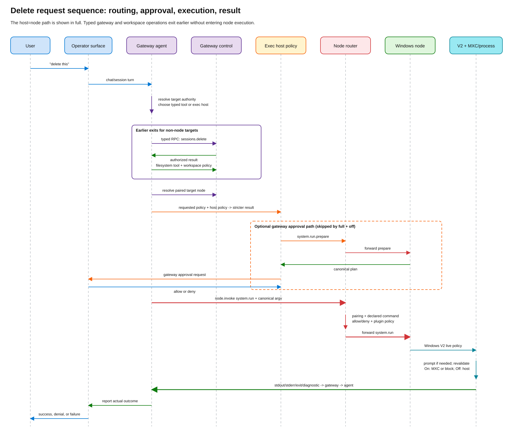
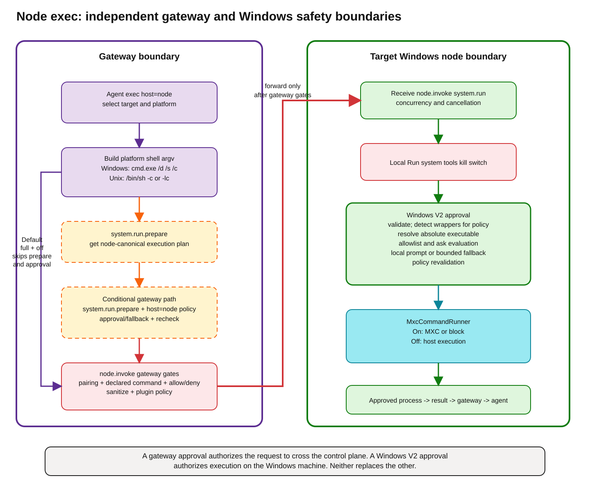

# OpenClaw Gateway, Node, and Exec Flow FAQ

This FAQ is the canonical end-to-end explanation of how an OpenClaw request
reaches a gateway or node, which component applies each policy, and how Windows
exec approval and sandboxing fit into the path.

The short mental model is:

> The gateway is the control plane and agent runtime. An operator controls that
> plane. A node offers machine-local capabilities. A request can reach a node
> only after the gateway routes it, and the target node still enforces its own
> local policy.

The diagrams and claims below were verified on 2026-08-06 against:

- OpenClaw Windows commit
  [`d7d153ca5d409487e06ef584b1de1184520e90e6`](https://github.com/openclaw/openclaw-windows-node/tree/d7d153ca5d409487e06ef584b1de1184520e90e6)
- upstream OpenClaw commit
  [`db90dff1396fecbf7029e9e9ea19d6c6ca3e644e`](https://github.com/openclaw/openclaw/tree/db90dff1396fecbf7029e9e9ea19d6c6ca3e644e)
- the managed gateway version installed by this repository,
  [`v2026.6.11`](https://github.com/openclaw/openclaw/tree/v2026.6.11)

## What are the important terms?

| Term | Meaning |
| --- | --- |
| Agent runtime | The model-and-tools runtime hosted by the gateway. It turns a user request into specific tool calls. |
| Gateway | The authoritative control plane for agents, sessions, channels, connected-node inventory, gateway configuration, operator approvals, and routing. |
| Operator | A control-plane client role. Operators read status, send chat, change gateway settings when scoped to do so, inspect nodes, and resolve gateway-owned approvals. |
| Node | A capability-host role. A node declares commands such as `screen.snapshot` or `system.run`, receives `node.invoke` requests, enforces local permissions, and returns results. |
| Windows app | One process that can host two separate gateway connections: an operator connection and a node connection. It can also expose the same local capabilities through local MCP. |
| `exec` | The agent-facing shell tool. Its selected host can be the gateway, an agent sandbox, or a node. |
| `system.run` | A low-level node command used to execute an already-routed command on a specific node. It is not the universal implementation of every `exec`. |
| Node command policy | Gateway policy that decides whether a declared node command may cross the gateway-to-node boundary. |
| Exec approval policy | Policy that decides whether a particular command may execute on the selected host and whether a human must approve it. |
| Sandbox policy | Policy that constrains what an executing process can access. It is applied after routing and approval. |

## What are the operator, gateway, and node boundaries?


[Edit the topology diagram](diagrams/openclaw-topologies-and-authority.excalidraw).

The gateway owns shared control-plane state. A node owns the capabilities and
local safety boundary of one machine. An operator is a client that can inspect
or mutate gateway state according to its scopes.

The Windows app does not become a gateway merely because it is both an
operator and a node. It opens separate role connections:

- `OpenClawGatewayClient` connects with `role: "operator"`.
- `WindowsNodeClient` connects with `role: "node"` and advertises its local
  capabilities and commands.

The app can therefore show gateway-wide node inventory in its operator UI while
its node connection remains responsible only for the local Windows machine.

**Evidence:** the Windows node handshake sends `role = "node"`, its own
capabilities, commands, and permissions in
[`WindowsNodeClient.cs`](https://github.com/openclaw/openclaw-windows-node/blob/d7d153ca5d409487e06ef584b1de1184520e90e6/src/OpenClaw.Shared/WindowsNodeClient.cs#L650-L714).
The operator client separately requests gateway-owned `node.list` in
[`OpenClawGatewayClient.cs`](https://github.com/openclaw/openclaw-windows-node/blob/d7d153ca5d409487e06ef584b1de1184520e90e6/src/OpenClaw.Shared/OpenClawGatewayClient.cs#L742-L748).
Upstream defines operator as a control-plane role and node as a capability-host
role in the
[`Gateway protocol`](https://github.com/openclaw/openclaw/blob/db90dff1396fecbf7029e9e9ea19d6c6ca3e644e/docs/gateway/protocol.md#roles-and-scopes).

## Does a node know what other nodes are connected?

Not by virtue of being a node.

The gateway owns the node registry and answers `node.list`. A pure node
connection registers itself and receives invocations addressed to itself. It
does not receive an automatic peer-node directory.

The Windows app can appear to "know" about a Mac node because the same process
also has an operator connection. That operator connection requests `node.list`
and projects the result into the Windows UI. The knowledge belongs to the
operator side of the process, not to the Windows node role.

This distinction matters in headless or node-only deployments. A node-only
process has no operator inventory unless it separately connects with suitable
operator credentials and calls the operator API.

**Evidence:** upstream node selection calls gateway-owned node listing before
choosing a target in
[`bash-tools.exec-host-node-phases.ts`](https://github.com/openclaw/openclaw/blob/db90dff1396fecbf7029e9e9ea19d6c6ca3e644e/src/agents/bash-tools.exec-host-node-phases.ts).
The Windows operator path stores the returned list in `AppState.Nodes`; the
node transport has no equivalent peer-list field.

## If both a Mac node and a Windows node are connected, what do they share?

They share the gateway control plane, not one combined local policy.

They can share:

- gateway sessions, agents, channels, and routing;
- gateway node command allow/deny policy;
- gateway-owned exec approval policy for an agent and selected exec host;
- pairing and node inventory maintained by that gateway;
- gateway plugin policy that runs before a `node.invoke` is dispatched.

They do not automatically share:

- OS permissions such as camera, screen, filesystem, or Windows consent;
- the node's locally advertised command set;
- the node-local exec approval store;
- Windows MXC settings or a Mac app's local execution settings;
- local files, environment variables, PATH, or sandbox availability.

The gateway evaluates policy and chooses one target node. The selected node then
applies its own local checks. An allow on the Mac does not authorize Windows,
and an allow on Windows does not authorize the Mac.

## Which settings are authoritative where?

| Setting or state | Authority | Windows app behavior |
| --- | --- | --- |
| Agents, sessions, channels, exec host selection, gateway exec policy | Gateway | Read or mutate through gateway APIs when the operator connection has scope. Do not invent a second local source of truth. |
| Connected and paired node inventory | Gateway | Read through `node.list` and pairing APIs. |
| Gateway node command allow/deny policy | Gateway config | Display and diagnose it through the operator connection. |
| Gateway endpoint and credentials | Windows gateway registry | Store connection metadata and role-specific credentials needed to reach the gateway. This is connection state, not a copy of gateway policy. |
| Node Mode and locally advertised Windows capabilities | Windows app | Local, because they decide what this Windows machine offers. |
| Windows `system.run` kill switch | Windows app | Local and enforced before local exec approval. |
| Windows exec approvals | Windows `exec-approvals.json` | Local and authoritative for Windows process execution. |
| Windows MXC filesystem, network, clipboard, timeout, and sandbox settings | Windows app | Local and enforced by the Windows command runner. |
| Agent sandbox backend and workspace access | Gateway agent config | Gateway-side execution concern, separate from Windows MXC. |

The design rule is: gateway-owned state should be observed or changed through
the operator API, while machine-local capability and containment settings stay
with the node. The Windows gateway registry stores how to connect, not a shadow
copy of the gateway's execution policy.

## Can an operator remotely change the Windows node's exec policy?

Only through the dedicated exec-approval management path, and remote changes
cannot make Windows policy more permissive.

The gateway rejects raw `node.invoke` calls to `system.execApprovals.get` and
`system.execApprovals.set`; callers must use the scoped
`exec.approvals.node.*` control-plane methods. When a validated update reaches
Windows, the node requires a current `baseHash` compare-and-swap token. It
rejects stale writes, new allowlist entries, looser security, weaker ask or
fallback modes, and remotely enabling `autoAllowSkills`.

This preserves the authority split:

- an operator can inspect policy and make it stricter through the gateway;
- the Windows owner must make a new permissive or persistent local grant through
  an attended local decision;
- the Windows node remains authoritative for the file it will enforce.

**Evidence:** the gateway blocks the raw commands in
[`nodes.invoke.ts`](https://github.com/openclaw/openclaw/blob/db90dff1396fecbf7029e9e9ea19d6c6ca3e644e/src/gateway/server-methods/nodes.invoke.ts).
Windows compare-and-swap and monotonicity checks are in
[`SystemCapability.cs`](https://github.com/openclaw/openclaw-windows-node/blob/d7d153ca5d409487e06ef584b1de1184520e90e6/src/OpenClaw.Shared/Capabilities/SystemCapability.cs#L449-L698).

`baseHash` travels in one direction only, and the upstream schema enforces that.
In
[`exec-approvals.ts`](https://github.com/openclaw/openclaw/blob/db90dff1396fecbf7029e9e9ea19d6c6ca3e644e/packages/gateway-protocol/src/schema/exec-approvals.ts#L104-L165),
`ExecApprovalsNodeSnapshotSchema` sets `additionalProperties: false` at line 119
and its no-file branch lists `{ required: ["baseHash"] }` at line 126 inside a
`not.anyOf` guard:

```ts
    additionalProperties: false,
    oneOf: [
      {
        required: ["path", "exists", "hash", "file"],
        not: {
          anyOf: [
            { required: ["enabled"] },
            { required: ["baseHash"] },
```

A `get` response carrying `path`, `exists`, `hash`, `file`, and `baseHash`
therefore matches no branch of the `oneOf` and is rejected by the gateway. The
node must omit `baseHash` from the snapshot it returns. A client reads `hash`
from that snapshot and passes it back as `baseHash` on the next `set`, which is
how the compare-and-swap closes. Omitting it from the response is required for
protocol conformance, not merely tidier.

## What happens when a user says "delete this"?

There is no universal "delete subsystem." The gateway agent first resolves what
"this" refers to and which authority owns it. It then chooses a typed operation
or an exec host, passes that path's policy gates, executes exactly one selected
operation, and returns the result to the agent.


[Edit the request-routing diagram](diagrams/openclaw-request-and-tool-routing.excalidraw).

The same decision as a time-ordered sequence:



[Edit the sequence diagram](diagrams/openclaw-delete-request-sequence.excalidraw).

The flow has four stages:

1. **Resolve the target.** Is "this" gateway state, an agent workspace file, an
   operating-system resource, or a purpose-built node capability?
2. **Choose the authoritative operation.** Prefer a typed gateway or node
   operation. Use shell exec only when the target requires shell semantics.
3. **Authorize and execute on one host.** Gateway state stays in the gateway.
   Workspace files stay under workspace/sandbox policy. Shell exec resolves to
   sandbox, gateway, or an explicitly selected node.
4. **Converge on one result.** The chosen operation returns success, denial, or
   failure to the agent, which reports the outcome to the user.

The concrete branches are:

1. **A gateway API operation.** Deleting a session can become a typed gateway
   RPC such as `sessions.delete`. No node or shell is required.
2. **A workspace file tool.** Deleting a file in an agent workspace can use a
   filesystem tool, subject to agent tool policy and workspace/sandbox policy.
3. **Gateway-host shell exec.** The model can call `exec` with
   `host=gateway`. Gateway-host exec approval is evaluated, then the gateway
   runs the command on its own host.
4. **Sandbox-host shell exec.** The model can call `exec` with
   `host=sandbox`. The gateway runs the command through the configured agent
   sandbox backend.
5. **Node-host shell exec.** The model can call `exec` with `host=node`. The
   gateway selects a node, creates platform shell argv, applies gateway-owned
   node-host approval, and dispatches `system.run` to that node.
6. **A purpose-built node command.** For a capability with a typed command, the
   gateway can call that command directly through `node.invoke` instead of
   using shell exec.

The user-visible verb therefore does not prove which subsystem performed the
operation. Logs and tool events must identify the selected tool, host, node,
approval, and execution mode.

For the agent-facing `exec` tool, `host=auto` resolves to the active agent
sandbox when one exists and otherwise to the gateway. Node execution is a
distinct `host=node` selection and requires a paired node. This prevents
"auto" from silently turning a sandboxed run into a remote node run.

**Evidence:** host values and `auto` resolution are documented in upstream
[`docs/tools/exec.md`](https://github.com/openclaw/openclaw/blob/db90dff1396fecbf7029e9e9ea19d6c6ca3e644e/docs/tools/exec.md).

For a concrete Windows example, suppose "delete this" refers to a file that
exists only on a selected Windows node and the model chooses shell exec. The
gateway can build:

```json
["cmd.exe", "/d", "/s", "/c", "del /q \"C:\\temp\\example.txt\""]
```

The gateway evaluates its `host=node` policy, dispatches `system.run`, and
Windows separately evaluates the exact wrapper and payload under V2 before MXC
or host execution. Windows recognizes the strict canonical `cmd.exe /d /s /c`
carrier and looks through it to the payload, so the durable approval identity is
the payload's resolved executable plus an exact argument pattern, not the command
host. The carrier itself is never the approved identity.

In this specific example the payload is `del`, a `cmd` built-in with no standalone
executable to resolve, so nothing is bindable: **Allow once** can run the command
and **Allow always** is still rejected with
`persistent-approval-not-permitted-for-command-host`. A payload that does resolve
to a real `.exe` behaves differently. For
`["cmd.exe","/d","/s","/c","hostname.exe"]`, **Allow always** is permitted and
records `C:\Windows\System32\hostname.exe` with an argument pattern that matches
only that exact argument list. It does not create a durable grant for general
`cmd.exe` execution.

Binding is refused, leaving the request prompt-only, when the payload executable
is not a plain `.exe`, when the payload cannot be tokenized unambiguously, when
the resolved path contains a space or other character that `cmd /s` would not
preserve verbatim, or when the carrier is not the strict canonical form. Fail
closed is the intended outcome in each of those cases.

## How does agent `exec` become node `system.run`?

Only the `host=node` branch performs this translation.

At the reviewed upstream revision, the flow is:

1. The `exec` tool resolves effective host, security, ask mode, cwd, timeout,
   environment, and optional requested node.
2. The gateway lists eligible nodes and resolves the requested or configured
   node. Multiple eligible nodes require an explicit selection.
3. The gateway verifies that the target is connected and declares
   `system.run`.
4. The gateway converts the shell command string to platform argv:
   - Windows: `["cmd.exe", "/d", "/s", "/c", command]`
   - macOS: `["/bin/sh", "-c", command]`
   - other Unix-like nodes: `["/bin/sh", "-lc", command]`
5. If gateway `host=node` policy resolves to `security=full` and `ask=off`,
   and strict inline-eval review is not enabled, the gateway skips prepare and
   gateway approval and dispatches `system.run` directly. This is the upstream
   default for gateway and node hosts.
6. Otherwise, the gateway calls `system.run.prepare`. The node returns a
   canonical plan used to evaluate approval.
7. The gateway evaluates its `host=node` exec approval policy. If necessary it
   creates an operator-visible exec approval request and waits, follows up
   asynchronously, or applies the configured timeout fallback.
8. Before dispatch, the gateway rechecks current policy.
9. The gateway calls `node.invoke` with command `system.run`, canonical argv,
   raw command text, cwd, timeout, agent/session identity, and approval context.
10. `node.invoke` verifies pairing generation, operator scope where required,
   declared commands, gateway allow/deny policy, parameter sanitization, and
   plugin node-invoke policy before forwarding the request.
11. The target node evaluates and executes the request locally, then returns a
    result through `node.invoke.result`.

**Evidence:** upstream orchestration is in
[`bash-tools.exec-host-node.ts`](https://github.com/openclaw/openclaw/blob/db90dff1396fecbf7029e9e9ea19d6c6ca3e644e/src/agents/bash-tools.exec-host-node.ts)
and
[`bash-tools.exec-host-node-phases.ts`](https://github.com/openclaw/openclaw/blob/db90dff1396fecbf7029e9e9ea19d6c6ca3e644e/src/agents/bash-tools.exec-host-node-phases.ts).
Platform wrapper construction is centralized in
[`node-shell.ts`](https://github.com/openclaw/openclaw/blob/db90dff1396fecbf7029e9e9ea19d6c6ca3e644e/src/infra/node-shell.ts).
Gateway dispatch gates are in
[`nodes.invoke.ts`](https://github.com/openclaw/openclaw/blob/db90dff1396fecbf7029e9e9ea19d6c6ca3e644e/src/gateway/server-methods/nodes.invoke.ts).
The default host policy and strict inline-eval exception are documented in
[`docs/tools/exec.md`](https://github.com/openclaw/openclaw/blob/db90dff1396fecbf7029e9e9ea19d6c6ca3e644e/docs/tools/exec.md)
and implemented by `shouldSkipNodeApprovalPrepare` in
[`bash-tools.exec-host-node-phases.ts`](https://github.com/openclaw/openclaw/blob/db90dff1396fecbf7029e9e9ea19d6c6ca3e644e/src/agents/bash-tools.exec-host-node-phases.ts).

## What exactly happens inside the Windows node for `system.run`?



[Edit the exec-flow diagram](diagrams/openclaw-node-exec-approval-and-sandbox-flow.excalidraw).

The Windows path is:

1. `WindowsNodeClient` receives `node.invoke.request`.
2. It validates the request id and command, resolves the registered capability,
   applies the invocation concurrency limit, and creates a cancellation scope.
3. `SystemCapability` first enforces the local **Run system tools** kill switch.
4. For `system.run.prepare`, it validates the low-level request and returns the
   canonical plan without executing.
5. For `system.run`, it sends the request through the Windows V2 approval
   coordinator.
6. V2 validates the input, unwraps transparent `env` prefixes, detects shell
   wrappers for allowlist analysis, resolves the actual `argv[0]` executable,
   builds a canonical identity, loads the node-local policy, and evaluates it.
7. If required and an attended Windows desktop can present UI, V2 asks for
   **Deny**, **Allow once**, or **Allow always**. If UI cannot be presented, the
   configured fallback is bounded by the active security policy and defaults to
   deny.
8. V2 revalidates policy currency immediately before execution. A policy change
   while approval is pending invalidates the approval.
9. The approved payload contains the resolved absolute executable path and
   canonical argv. The runner must execute that payload, not reconstruct it
   from untrusted raw text.
10. `MxcCommandRunner` requires MXC while Node Sandbox is on and denies if containment
    is unavailable. It uses the host runner only when Node Sandbox is explicitly off.
11. The node returns stdout, stderr, exit code, timeout, duration, and diagnostic
    execution mode to the gateway.

**Evidence:** Windows dispatch is in
[`WindowsNodeClient.cs`](https://github.com/openclaw/openclaw-windows-node/blob/d7d153ca5d409487e06ef584b1de1184520e90e6/src/OpenClaw.Shared/WindowsNodeClient.cs#L1180-L1338).
The `system.run` boundary and execution call are in
[`SystemCapability.cs`](https://github.com/openclaw/openclaw-windows-node/blob/d7d153ca5d409487e06ef584b1de1184520e90e6/src/OpenClaw.Shared/Capabilities/SystemCapability.cs#L195-L418).
The approval pipeline and execution-boundary revalidation are in
[`ExecApprovalsCoordinator.cs`](https://github.com/openclaw/openclaw-windows-node/blob/d7d153ca5d409487e06ef584b1de1184520e90e6/src/OpenClaw.Shared/ExecApprovals/ExecApprovalsCoordinator.cs#L47-L389).

## What is exec host policy, who chooses it, and how are policies combined?

Exec host policy answers two separate questions:

1. **Where may this shell command run?** The resolved host is `sandbox`,
   `gateway`, or one selected `node`.
2. **What approval posture applies on that host?** The effective values are
   `security`, `ask`, `askFallback`, and the applicable allowlist.

The gateway agent runtime resolves the host from `tools.exec.host`, any
authorized session `/exec` override, and the tool request:

- `host=auto` selects the active agent sandbox when one exists, otherwise the
  gateway;
- a node is selected only by explicit `host=node` routing or a configured node
  default;
- an explicit gateway escape from an active sandbox is not a free override and
  must satisfy the elevated-access rules.

The persisted gateway-side policy knob is `tools.exec.mode`, globally or per
agent. It maps to `security` and `ask`:

| Mode | Security | Ask |
| --- | --- | --- |
| `deny` | `deny` | `off` |
| `allowlist` | `allowlist` | `off` |
| `ask` | `allowlist` | `on-miss` |
| `auto` | `allowlist` | `on-miss`, with native auto-review before human fallback |
| `full` | `full` | `off` |

The selected execution host also has its own approvals document. The gateway
combines the requested config/session policy with that host document
**field-by-field to the stricter result**:

```text
effective security    = stricter(requested security, host security)
effective ask         = stricter(requested ask, host ask)
effective askFallback = stricter(effective security, host askFallback)
```

In source, this is `minSecurity`, `maxAsk`, and `minSecurity`. The enum ordering
makes `deny` stricter than `allowlist`, which is stricter than `full`; and
`always` is stricter than `on-miss`, which is stricter than `off`.

This means:

- config can request a restrictive posture that the host file cannot loosen;
- the host owner can tighten policy without rewriting gateway config;
- no later value wins merely because the command flowed past it;
- a permissive setting at one layer never cancels a denial at another layer.

Within one approvals document, scalar fields use a specificity cascade:

```text
agent entry -> wildcard "*" entry -> defaults -> system defaults
```

The first defined scalar wins in that cascade. Allowlists are the one additive
case: wildcard and agent-specific entries are combined, normalized, and then
matched. That local allowlist combination still cannot override an effective
`security=deny`, an `ask=always` requirement, or a denial at another boundary.

For `host=node`, there is an additional boundary. The gateway first applies its
effective `host=node` policy and the gateway node-command gates. The selected
node then applies its own local policy again. These are **sequential AND gates**,
not a merged union:

| Gateway result | Node result | Outcome |
| --- | --- | --- |
| Deny | Not reached | Denied by gateway |
| Allow | Deny | Denied by node |
| Allow after gateway approval | Local approval required | Node may show a second, independent prompt |
| Allow | Allow | Execute, subject to sandbox and process constraints |

The gateway can fetch a compatible node's policy snapshot during
`system.run.prepare` and use stricter node values when deciding whether its own
approval is required. That is an early conservative check, not delegation of
the node's authority. The node still evaluates live local policy at execution
time. If the node policy is unknown, the gateway approval path treats it
conservatively; the default gateway `full`/`off` fast path can still dispatch
directly, after which the node remains the decisive local gate.

### Who can edit each layer?

| Layer | Typical editor | Scope and limits |
| --- | --- | --- |
| `tools.exec.host` and `tools.exec.mode` | Gateway owner or scoped administrator through config/CLI/Control UI | Global or per-agent requested policy. |
| Session `/exec` defaults | An authorized sender for that session | Session-only. Does not rewrite the host approvals document. |
| Gateway-host approvals | Gateway machine owner, or an authorized operator using gateway approval APIs | Local to the gateway execution host. |
| Node-host approvals | Node machine owner; an authorized operator through `openclaw approvals set --node` when supported | Local to that node. |
| Windows V2 approvals | Windows owner through Companion settings and attended prompts | Windows is authoritative. Remote updates require compare-and-swap and may tighten, but cannot add allowlist grants or loosen policy. |
| Sandbox access policy | Owner of the selected sandbox or Windows node settings | Applied after routing and approval; can still prevent filesystem, network, clipboard, or UI access. |

**Evidence:** upstream policy merging is implemented in
[`bash-tools.exec-host-shared.ts`](https://github.com/openclaw/openclaw/blob/db90dff1396fecbf7029e9e9ea19d6c6ca3e644e/src/agents/bash-tools.exec-host-shared.ts)
and documented in
[`docs/tools/exec.md`](https://github.com/openclaw/openclaw/blob/db90dff1396fecbf7029e9e9ea19d6c6ca3e644e/docs/tools/exec.md)
and
[`docs/tools/exec-approvals.md`](https://github.com/openclaw/openclaw/blob/db90dff1396fecbf7029e9e9ea19d6c6ca3e644e/docs/tools/exec-approvals.md).
The Windows scalar cascade and additive wildcard/agent allowlists are in
[`ExecApprovalsStore.cs`](https://github.com/openclaw/openclaw-windows-node/blob/d7d153ca5d409487e06ef584b1de1184520e90e6/src/OpenClaw.Shared/ExecApprovals/ExecApprovalsStore.cs#L787-L835).

## Why are there both gateway and node exec approvals?

They protect different authority boundaries.

| Check | Owner | Applies to | Question answered |
| --- | --- | --- | --- |
| Agent tool policy | Gateway | Every proposed tool call | May this agent use `exec` and select this host? |
| Gateway exec approval, `host=gateway` | Gateway | Commands that run on the gateway host | May this command run on the gateway machine? |
| Gateway exec approval, `host=node` | Gateway | Agent requests routed to a node | May this agent/session ask this selected node to run this command? |
| Gateway node command policy | Gateway | Every `node.invoke` | May this declared command cross the gateway-to-node boundary? |
| Node-local exec approval | Target node | `system.run` on that machine | Will the owner of this machine allow this exact executable and argv? |
| Sandbox policy | Actual execution host | The approved process | What can the process access while running? |

For a node-targeted exec, both gateway-owned approval and node-local approval
can apply, but gateway approval is conditional. Upstream defaults gateway and
node host policy to `security=full` and `ask=off`, which skips gateway prepare
and approval unless stricter policy or strict inline-eval review is configured.
Windows local V2 still applies independently and defaults to `allowlist`,
`on-miss`, with deny fallback. Passing or skipping the gateway approval is not a
bypass token for the node.

**Evidence:** upstream host defaults are documented in
[`docs/tools/exec.md`](https://github.com/openclaw/openclaw/blob/db90dff1396fecbf7029e9e9ea19d6c6ca3e644e/docs/tools/exec.md).
Windows defaults are resolved in
[`ExecApprovalsStore.cs`](https://github.com/openclaw/openclaw-windows-node/blob/d7d153ca5d409487e06ef584b1de1184520e90e6/src/OpenClaw.Shared/ExecApprovals/ExecApprovalsStore.cs#L606-L621).

They are not both applied to every command:

- A gateway-host command never enters the Windows node, so Windows V2 and MXC
  do not apply.
- A node-targeted command does not execute under the gateway host's local
  process policy. It passes gateway `host=node` policy, including approval when
  required, and the selected node's local policy.
- A non-exec node command passes node command policy and its capability-specific
  local permission checks, not the `system.run` approval pipeline.

## What is Windows exec approval V2, and what was V1?

Windows V1 and V2 are generations of the Windows node's local authorization
boundary.

| Area | V1 | V2 |
| --- | --- | --- |
| Input identity | Shell command text | Canonical argv plus resolved executable identity |
| Typical rule | Command-text glob | Executable/argument-aware allowlist entries |
| Shell ambiguity | Rule could accidentally authorize a reusable command host such as `cmd.exe` or PowerShell | Shell wrappers are structurally classified and bound to an exact argument pattern, so an indirect command host cannot receive unsafe persistent approval |
| Prompt result | Legacy behavior | Explicit allow-once or allow-always, with deny |
| Race handling | Limited | Policy snapshot and execution-boundary revalidation |
| Execution | Could reparse shell text | Approved absolute executable and argv are passed to the runner |
| Failure posture | Legacy fallback existed | Invalid, malformed, stale, or unavailable state fails closed |

The old Windows `exec-policy.json` command-text rules are not evaluated or
mechanically converted. Conversion could widen a narrow-looking text rule into
a grant for a general command interpreter. Existing V1 approvals therefore
require a new attended decision under V2.

The mechanism behind the "shell ambiguity" row is structural, not a maintained
list of dangerous program names. A resolved executable is classified by shape as
a shell wrapper, interpreter, or code host, and every durable entry written by
V2 carries an argument pattern that must match the exact argument list. A name
catalog is not the security boundary, because renaming a binary would defeat it.

One narrow legacy case remains. An allowlist entry written before argument
binding existed has neither a recorded source nor an argument pattern. Such an
entry stays valid for an ordinary executable, but it is inert when its resolved
executable is one of the interpreters or indirect command hosts that were
already refused durable approval at the time the entry could have been written.
Those requests prompt instead of matching. The entry is not deleted and is not
silently upgraded; only an explicit **Allow always** creates a new
argument-bound entry that can match.

Do not confuse the pipeline name with the persisted schema field.
`exec-approvals.json` currently contains `"version": 1`; that is the file
format version used by the V2 pipeline. Also, the store's "legacy migration"
moves a valid `exec-approvals.json` between state-directory locations. It does
not migrate V1 `exec-policy.json` authorization semantics.

**Evidence:** the V2 data model is in
[`ExecApprovalsContracts.cs`](https://github.com/openclaw/openclaw-windows-node/blob/d7d153ca5d409487e06ef584b1de1184520e90e6/src/OpenClaw.Shared/ExecApprovals/ExecApprovalsContracts.cs).
The store requires file schema version 1 and migrates only a prior file
location in
[`ExecApprovalsStore.cs`](https://github.com/openclaw/openclaw-windows-node/blob/d7d153ca5d409487e06ef584b1de1184520e90e6/src/OpenClaw.Shared/ExecApprovals/ExecApprovalsStore.cs#L320-L454).

## Is a command always wrapped in `/bin/sh`, `cmd.exe`, or PowerShell?

No. There are two different interfaces:

1. The agent-facing `exec` tool is shell-oriented. For `host=node`, the gateway
   intentionally turns its command string into platform shell argv. This is why
   normal Windows node exec uses `cmd.exe /d /s /c`, macOS uses
   `/bin/sh -c`, and other Unix-like nodes use `/bin/sh -lc`.
2. The low-level Windows `system.run` boundary accepts canonical
   `command: string[]`. It can launch an executable directly without a shell.

On Windows, V2 resolves `argv[0]` to an absolute executable and
`LocalCommandRunner` uses `ProcessStartInfo.ArgumentList`, so no additional
shell reparses the approved argv. If the argv itself names `cmd.exe`, then
`cmd.exe` is the directly launched executable and it interprets the remaining
shell payload by design.

Batch files are a special case. Windows cannot execute `.bat` or `.cmd`
directly through `CreateProcess` without `cmd.exe`; V2 rejects them as a
direct-argv executable rather than silently adding a shell after approval.

**Evidence:** direct-argv launch and batch-file rejection are in
[`LocalCommandRunner.cs`](https://github.com/openclaw/openclaw-windows-node/blob/d7d153ca5d409487e06ef584b1de1184520e90e6/src/OpenClaw.Shared/LocalCommandRunner.cs#L190-L235).

## How does local command output finish draining?

`LocalCommandRunner` observes process exit separately from stdout/stderr EOF.
After exit, it awaits both reader EOF signals without blocking a thread-pool
worker. This avoids competing with the output callbacks during concurrent runs.
The existing 500 ms drain deadline still bounds commands whose background
children inherit the pipes. If EOF has not arrived by that deadline, the runner
logs a warning and returns the output captured so far; descendant output after
the deadline is not guaranteed.

## Can OpenClaw use `execve` or direct process execution?

The low-level execution layer can execute argv directly. The user-facing
cross-platform agent `exec` tool remains shell-oriented.

- Upstream node hosts pass an argv array to the process runner.
- Windows V2 passes an absolute executable and argument list to
  `Process.Start` with `UseShellExecute=false`.
- Unix implementations ultimately use the platform's spawn facilities rather
  than exposing a separate user-facing `execve` tool.

Use direct argv when a caller already has a typed executable and arguments.
Use the shell-oriented `exec` tool when shell syntax, pipelines, redirection,
globbing, or built-ins are part of the requested command. Direct argv avoids
one shell parsing layer but is not a substitute for approval, node command
policy, or sandboxing.

## How does Windows sandboxing work, and is it a gateway plugin?

Windows MXC sandboxing is node-local and is not a gateway plugin.

`NodeService` constructs this local runner chain:

```text
SystemCapability
  -> Windows V2 exec approval
  -> MxcCommandRunner
     -> DirectAppContainerExecutor -> wxc-exec.exe -> AppContainer process
     -> LocalCommandRunner only when Node Sandbox is off
```

The Windows app knows:

- whether MXC is available on this host;
- whether Windows sandboxing is enabled;
- local filesystem, network, clipboard, Windows UI API, timeout, and output policies;
- whether the saved Off preference permits host execution.

The gateway knows that it routed `system.run` to a Windows node and receives the
result. It does not build the Windows MXC policy. The Windows node does.

Upstream also has separate sandbox and plugin concepts:

- the agent runtime can run `exec` in a gateway-configured sandbox backend such
  as Docker, Podman, or another backend;
- gateway plugins can apply `node.invoke` policy before a request is forwarded;
- node-host plugins can publish additional typed node commands.

Those extension points do not make MXC a gateway plugin. They are separate
layers with different owners.

### Host limitation: some hosts cannot spawn a child executable under MXC

On some Windows hosts the AppContainer starts and runs `cmd` builtins, but the
first child executable it tries to launch never runs. Two signatures have been
observed for the same underlying incapacity:

- the child dies during DLL initialization, reported as exit code `0xC0000142`
  (`STATUS_DLL_INIT_FAILED`);
- `CreateProcess` is refused outright, reported as exit code `1` with
  `Access is denied.` on stderr.

This is a sandbox-runtime property of the host. It is independent of exec
approvals: it reproduces with `security=full`, with no allowlist entry
involved, and with the command executed exactly as the gateway sent it, so it
is not caused by argument binding, by pinning a payload to a resolved absolute
path, or by any V2 decision. A `cmd` builtin such as `echo` still succeeds in
the same container, which is what isolates the failure to process creation.

Consequences for validation on such a host: approval decisions are still
provable end to end through a real gateway, because the decision is asserted
from the node's own log and from the MXC request shape. Whether the approved
command then produces output is not provable there. The MXC E2E records this
explicitly rather than passing quietly, and it never tolerates any other
nonzero exit code. See `Diagnostic_SystemRun_SpawnsChildExecutableInSandbox`
and `AssertApprovedCommandRan` in `tests/OpenClaw.E2ETests/Setup/MxcSetupAndConnectTests.cs`.

By default, Windows enables sandboxing and blocks commands if MXC is unavailable,
including loss of containment at runtime. Availability checks do not clear the
enabled preference. Host execution requires the saved Node Sandbox preference to be
Off. Existing Off values remain unchanged, including ones earlier versions saved
automatically on unsupported hosts; review those settings because historical intent
cannot be distinguished from a deliberate opt-out.
The legacy `SystemRunBlockHostFallbackWhenMxcUnavailable` field no longer affects
policy, including when older profiles contain `false`. Results report sandbox or
host mode; host-fallback values remain historical telemetry only.

MXC also blocks Win32k system calls by default. PowerShell (all versions) and
some console programs initialize Windows UI APIs even when they do not show a
window. Enable **Allow Windows UI APIs** on the Node Sandbox page when those
programs require Win32k compatibility. This keeps filesystem, network,
clipboard, timeout, and command approval controls in force, but removes the
Win32k syscall boundary. Clipboard policy and the input-injection denial remain
in force.

Windows UI access is not a process-enumeration permission and does not provide a
supported host-wide process inventory. In the behavior reported in
[issue #1149](https://github.com/openclaw/openclaw-windows-node/issues/1149),
`Get-CimInstance Win32_Process` could not connect and `tasklist` failed to
complete. `Get-Process` output must not be treated as either a complete host
inventory or a security guarantee that all host process metadata is hidden.
[PR #1151](https://github.com/openclaw/openclaw-windows-node/pull/1151),
merged as
[`36928782`](https://github.com/openclaw/openclaw-windows-node/commit/369287826f3966d67da251a91272dced1132a814),
bounds cancellation cleanup so a killed or timed-out sandbox invocation
returns; it does not change process visibility. Host-wide process inspection
requires uncontained host execution with the applicable approvals.

OpenClaw's `process` tool is a separate abstraction. It lists OpenClaw-managed
background exec sessions for the same agent, not arbitrary operating-system
processes.

**Evidence:** local runner wiring is in
[`NodeService.cs`](https://github.com/openclaw/openclaw-windows-node/blob/d7d153ca5d409487e06ef584b1de1184520e90e6/src/OpenClaw.Tray.WinUI/Services/NodeService.cs#L589-L679).
Fallback behavior is in
[`MxcCommandRunner.cs`](https://github.com/openclaw/openclaw-windows-node/blob/d7d153ca5d409487e06ef584b1de1184520e90e6/src/OpenClaw.Shared/Mxc/MxcCommandRunner.cs#L99-L207).
The direct `wxc-exec.exe` adapter is in
[`DirectAppContainerExecutor.cs`](https://github.com/openclaw/openclaw-windows-node/blob/d7d153ca5d409487e06ef584b1de1184520e90e6/src/OpenClaw.Shared/Mxc/DirectAppContainerExecutor.cs#L61-L169).
Gateway plugin policy runs before raw node dispatch in
[`nodes.invoke.ts`](https://github.com/openclaw/openclaw/blob/db90dff1396fecbf7029e9e9ea19d6c6ca3e644e/src/gateway/server-methods/nodes.invoke.ts).

## What is the bundled OpenClaw Policy plugin?

It is a conformance and attestation layer, not another runtime authorization
engine.

The plugin can report drift such as an unexpectedly enabled node command,
unapproved sandbox backend, or weak exec setting. It does not intercept a tool
call, rewrite runtime behavior, or replace the actual tool, gateway, approval,
node, and sandbox enforcement layers described above.

**Evidence:** upstream states this explicitly in
[`docs/cli/policy.md`](https://github.com/openclaw/openclaw/blob/db90dff1396fecbf7029e9e9ea19d6c6ca3e644e/docs/cli/policy.md).

## Are we pinned to a gateway protocol version or a gateway release?

Both exist, but they are separate mechanisms.

### Protocol negotiation

The reviewed Windows operator and node clients advertise:

```json
{ "minProtocol": 3, "maxProtocol": 4 }
```

The gateway returns its current protocol version in `hello-ok.protocol`. This
is not a per-connection negotiated or downgraded value. The current upstream
constants at the reviewed commit are:

- current protocol: 4;
- minimum general client protocol: 4;
- minimum authenticated node protocol: 3;
- minimum probe protocol: 3.

A Windows range of 3 through 4 can connect to an older protocol-3 gateway or a
current protocol-4 gateway. Against a current protocol-4 gateway, `maxProtocol:
4` satisfies the current protocol, so this Windows client does not enter
upstream's N-1 legacy-node path. That legacy path requires `role: "node"`,
`client.mode: "node"`, and a client range that does not support the gateway's
current protocol. Upstream withholds plugin-owned node capabilities and commands
only on that legacy path.

Windows records `hello-ok.protocol` for diagnostics but does not currently
branch behavior on it. Method and payload compatibility is still a separate
concern; the client uses feature/error handling and drift tests for the surfaces
it implements.

### Managed gateway release selection

The Windows setup engine uses the official installer without a version
argument, so npm `latest` selects the stable OpenClaw package for a new
app-managed WSL gateway. Setup records the installed version and requires the
gateway handshake to report that same version over protocol v4.

Windows can connect to an existing gateway with a different release if the
protocol and methods it uses are compatible. Custom installer URLs require an
exact version, are labeled unverified, and must pass the same installed-version
and protocol checks.

At tag `v2026.6.11`, upstream protocol constants were protocol 4 with minimum
general/probe protocol 4. Its documentation already showed clients advertising
a 3 through 4 range. That tag did not yet define a separate
`MIN_NODE_PROTOCOL_VERSION`; the node-specific minimum of 3 was added upstream
later. The installed release and the connect range must therefore be reported
independently.

**Evidence:** Windows connect ranges are in
[`WindowsNodeClient.cs`](https://github.com/openclaw/openclaw-windows-node/blob/d7d153ca5d409487e06ef584b1de1184520e90e6/src/OpenClaw.Shared/WindowsNodeClient.cs#L676-L714)
and
[`OpenClawGatewayClient.cs`](https://github.com/openclaw/openclaw-windows-node/blob/d7d153ca5d409487e06ef584b1de1184520e90e6/src/OpenClaw.Shared/OpenClawGatewayClient.cs#L1492-L1510).
The current upstream constants are in
[`version.ts`](https://github.com/openclaw/openclaw/blob/db90dff1396fecbf7029e9e9ea19d6c6ca3e644e/packages/gateway-protocol/src/version.ts).
The managed install checks are in
[`GatewayInstallPolicy.cs`](../src/OpenClaw.SetupEngine/GatewayInstallPolicy.cs).

## What deployment combinations are valid?

| Gateway | Operator | Node | What works |
| --- | --- | --- | --- |
| Gateway only | CLI/web/another operator may connect later | None | Agent runtime, channels, sessions, and gateway-host or sandbox tools. No machine-local node capabilities. |
| Existing gateway plus Windows operator only | Windows operator connection | None from Windows | Chat, status, configuration, approvals, and inventory. No Windows camera, screen, canvas, or `system.run`. |
| Existing gateway plus Windows node only | Another operator is needed for management | Windows node connection | Windows capabilities can be invoked after pairing and policy approval. The node itself does not become the management UI. |
| Existing gateway plus dual-role Windows app | Windows operator connection | Separate Windows node connection | Full Windows control UI plus local Windows capabilities. |
| Managed WSL gateway plus dual-role Windows app | Windows operator connection to WSL | Windows node connection from host Windows | Common all-in-one Windows topology. Gateway policy stays in WSL; Windows node policy and MXC stay on Windows. |
| Local MCP only | No gateway operator connection required | Local capability host, no gateway WebSocket | Local MCP clients can discover and call the same capability implementations. Capability-level permissions and Windows V2 approval still apply. |
| Mac gateway plus Mac and Windows nodes | Any scoped operator | Mac node and Windows node | Shared gateway routing and inventory, separate node-local permissions and exec policies. |

## What must a node-targeted command pass, in order?

For `exec host=node` targeting the Windows app, the practical ordered checklist
is:

1. agent tool policy allows `exec`;
2. exec host selection resolves to `node`;
3. the gateway can select a paired, connected node that declares
   `system.run` and, when needed, `system.run.prepare`;
4. gateway `host=node` exec policy allows dispatch; it obtains approval only
   when policy is stricter than the default full/off path or strict inline-eval
   review requires it;
5. current gateway node command policy allows `system.run`;
6. gateway parameter sanitization and plugin node-invoke policy allow dispatch;
7. Windows has **Run system tools** enabled;
8. Windows V2 policy allows or obtains local approval;
9. Windows policy is still current at the execution boundary;
10. MXC containment and policy allow the operation, or Node Sandbox is explicitly off;
11. process launch succeeds with the approved executable, argv, cwd, timeout,
    and supported environment.

Any layer can deny. A later layer cannot widen an earlier deny.

## Source map

| Topic | Windows source | Upstream source |
| --- | --- | --- |
| Operator and node handshake | `OpenClawGatewayClient.cs`, `WindowsNodeClient.cs` | `docs/gateway/protocol.md`, gateway connect admission |
| Node inventory | `OpenClawGatewayClient.RequestNodesAsync` | gateway node registry and `node.list` |
| Exec host routing | n/a, Windows is the target host | `bash-tools.exec-run.ts`, `bash-tools.exec-host-gateway.ts`, `bash-tools.exec-host-node.ts` |
| Shell argv construction | `LocalCommandRunner` for its legacy shell path; V2 approved runs are direct argv | `src/infra/node-shell.ts` |
| Gateway node invoke gates | node receives only the post-gate request | `src/gateway/server-methods/nodes.invoke.ts` |
| Windows local approval | `ExecApprovalsCoordinator`, `ExecApprovalsStore`, `ExecReusableCommandBinder`, `CanonicalCmdCarrier`, `CmdPayloadTokenizer` | comparable node-host exec approval contracts |
| Windows sandbox | `MxcCommandRunner`, `MxcPolicyBuilder`, `DirectAppContainerExecutor` | separate agent sandbox backend interfaces |
| Protocol version | connect payloads | `packages/gateway-protocol/src/version.ts` |
| Managed gateway release | `GatewayInstallPolicy.cs`, setup engine | npm `latest` and the installed package metadata |
